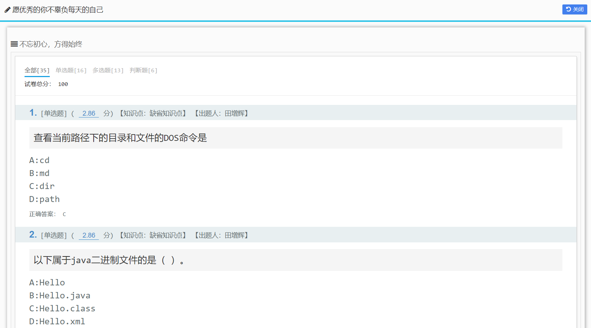
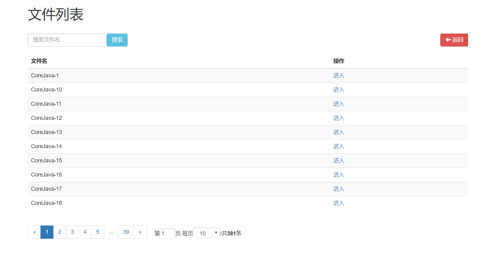

# 刷题吧

**刷题吧个人版**为之前`在线版本`的`桌面版本`

`在线版本`由于`访问压力`和`打理题库`的问题，所以`在线版本`进行下线处理

但是不辜负用户是我的初衷，开发了离线版本供大家使用，离线版本使用了`Java语言`编写可以一台机器运行`局域网`内到处访问，默认的`端口号`为80，运行方式使用了`cmd`，并保留了`命令窗口`，目的是方便随时关闭避免端口占用

+ 离线版本支持自己导入题库，支持`xls`和`xlsx`，已提供模板

+ 离线版本同样支持`看题`，`刷题`，`错题本`功能

+ 提供了用户成绩记录，和一个友好的`题库查询框`

+ 完全和平台样式保持一致，同时做了许多的优化

+ 注：内置使用默认浏览器打开，此程序仅用来做Windows系统的桌面应用，其他系统使用需修改`ApplicationInit`类

技术栈：

技术的选型非常简单，代码实现也是非常简单纯粹，简单的其中也进行了效率的处理，加入了`SpringBoot`默认的缓存解决方案，其中也做了很多的细节处理，比如说不同的页面收到的`JSON`是不一样的，使用了`Jackson`的动态过滤字段。

后端：

| 名称          | 介绍                                                    |
| ------------- | ------------------------------------------------------- |
| SpringBoot    | Spring框架快速上手                                      |
| SpringMVC     | Spring框架提供的视图框架                                |
| EasyExcel     | 阿里改装过的`POI`工具，`Java`操作`MicroSoft Office`文件 |
| 原生Serialize | 用于做桌面版应用的数据存储，并且使用了高效率的缓冲流    |

前端：

| 名称                | 介绍                    |
| ------------------- | ----------------------- |
| IndexedDB           | 前端提供的索引数据库    |
| BootStrap           | 一款精致的UI组件        |
| AngularJS           | Google公司的前端JS组件  |
| AngularJSPagination | 一款开源的AngularJS分页 |
| jQuery              | 前端框架的鼻祖          |

软件截图：

主页面

看题页面

刷题页面

分数页面

文件列表

> 已更新至2019-02-18

> + 进行了性能方面的优化
> + 增加了成绩导出功能
> + 增加了源码地址（© 开源项目，欢迎指导）
> + 使用了Lombok
> + 增加了Swagger2的API页面：http://127.0.0.1/swagger-ui.html
